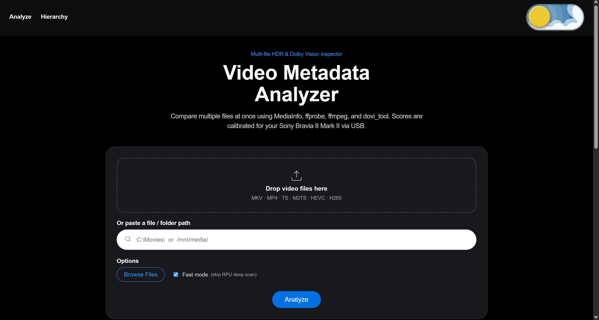
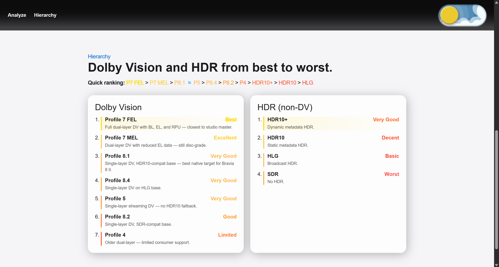

# Video Metadata Analyzer Dashboard


[](LICENSE)

A full-stack video analysis app that compares local movie files using MediaInfo, ffprobe, ffmpeg, and dovi_tool, then ranks playback quality for Sony Bravia 8 Mark II USB playback.

## What This Project Does

- Analyzes one or many video files (.mkv, .mp4, .ts, .m2ts, .hevc, .h265).
- Detects Dolby Vision profile details (including Profile 7 / 8 variants where possible).
- Computes quality, TV score, confidence score, and audio score.
- Shows rich comparison visuals: leaderboard, radar chart, score bars, and bitrate chart.
- Provides per-file USB compatibility hints for Bravia 8 Mark II.
- Supports background jobs with progress streaming (SSE) for long-running scans.

## Tech Stack

- Frontend: React 19 + TypeScript + Vite
- Backend: FastAPI (Python)
- Metadata/tooling: MediaInfo, ffprobe/ffmpeg, dovi_tool

## Project Structure

```text
videodashboard2/
  src/                 # React UI
  scripts/             # Helper scripts for polling/SSE testing
  uploads/             # Temporary upload storage (auto-used by backend)
  main.py              # FastAPI app and job orchestration
  analysis.py          # Core metadata extraction + scoring logic
```

## Screenshots 

- docs/screenshots/hero.png - landing / analyze screen
- docs/screenshots/hierarchy.png - DV/HDR ranking page

Markdown example:

```md


```

## Social Preview / Repo Card

I added a ready-to-use social preview SVG you can use as your repository card (1280×640):

- `docs/social-card.svg`

How to use it on GitHub:

1. Open your repository on GitHub and go to Settings → Social preview.
2. Upload a PNG/JPEG (or an exported PNG of the SVG) as the repository social preview image.

If you prefer to upload a PNG instead of the SVG, convert it locally:

- ImageMagick (convert):

```bash
magick convert docs/social-card.svg -background none -resize 1280x640 docs/social-card.png
```

- Inkscape (CLI):

```bash
inkscape docs/social-card.svg --export-type=png --export-width=1280 --export-height=640 --export-filename=docs/social-card.png
```

Notes:
- Keep important text and logos inside the 40pt safe margin (approx 53px) shown in the SVG.
- Replace the placeholder screenshot area in the SVG by editing the file or overlaying your exported UI shots, especially the analyze screen and hierarchy view.

## Prerequisites

Install these before running:

- Node.js 20+
- Python 3.11+
- FFmpeg (must include ffmpeg + ffprobe on PATH)
- MediaInfo CLI (mediainfo on PATH)
- dovi_tool (optional but recommended for deeper DV parsing)

## Quick Start

### One-command local startup (recommended on Windows)

```bash
npm run dev:stack
```

This launches backend and frontend in two dedicated PowerShell windows.

### 1) Install frontend dependencies

```bash
npm install
```

If you see an import error for axios, install it once:

```bash
npm install axios
```

### 2) Install backend Python dependencies

```bash
python -m pip install fastapi "uvicorn[standard]" python-multipart
```

Optional (for helper scripts):

```bash
python -m pip install requests
```

### 3) Start the backend (FastAPI)

```bash
python -m uvicorn main:app --reload --host 127.0.0.1 --port 8000
```

### 4) Start the frontend (Vite)

```bash
npm run dev
```

Open the app at the URL printed by Vite (usually http://127.0.0.1:5173 or http://localhost:5173).

If you need custom ports, run the script directly:

```powershell
powershell -ExecutionPolicy Bypass -File .\scripts\start-local.ps1 -Host 127.0.0.1 -ApiPort 8000 -WebPort 5173
```

## How To Use

1. Drag and drop video files, browse for files, or paste a server-local file/folder path.
2. Toggle Fast mode if you want quicker scans (skips deep RPU scan path).
3. Click Analyze.
4. Review ranked results, DV profile details, confidence, and USB compatibility guidance.

## API Endpoints

Core routes exposed by the backend:

- GET /health/ - service health + disk usage
- POST /analysis/ - analyze one multipart file
- POST /analyze-multiple/ - submit multi-file batch job
- GET /analyze-path/ - analyze a server-local file/folder as a background job
- GET /progress/{job_id} - SSE stream for path job progress
- GET /job/{job_id} - poll job status/results
- GET /job/{job_id}/events - SSE stream of job events
- GET /scan-folder/ - synchronous folder scan

## Helper Scripts

The scripts folder includes quick diagnostics:

- scripts/run_and_poll.py: upload a file via curl and poll /job/{job_id}
- scripts/test_sse.py: trigger analyze-path and print SSE events

## Notes On Accuracy

- Scores are heuristic, not absolute truth.
- dovi_tool improves confidence when available.
- Fast mode is faster but may reduce certainty for edge cases.
- USB compatibility checks target Sony Bravia 8 Mark II behavior and practical constraints.

## Troubleshooting

- 507 disk full: clean the uploads folder and free local disk space.
- Upload too large (413): current backend limit is 75 GB per file.
- No Dolby Vision details: verify ffprobe/mediainfo availability and file DV signaling.
- CORS/UI issues: use localhost/127.0.0.1 for both frontend and backend.

## Development Commands

```bash
npm run dev      # frontend dev server
npm run dev:stack # launch backend + frontend together (Windows)
npm run build    # frontend production build
npm run preview  # preview production build
npm run lint     # lint frontend code
```

## License

This project is licensed under the [MIT License](LICENSE)
